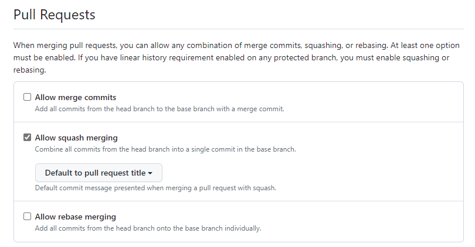
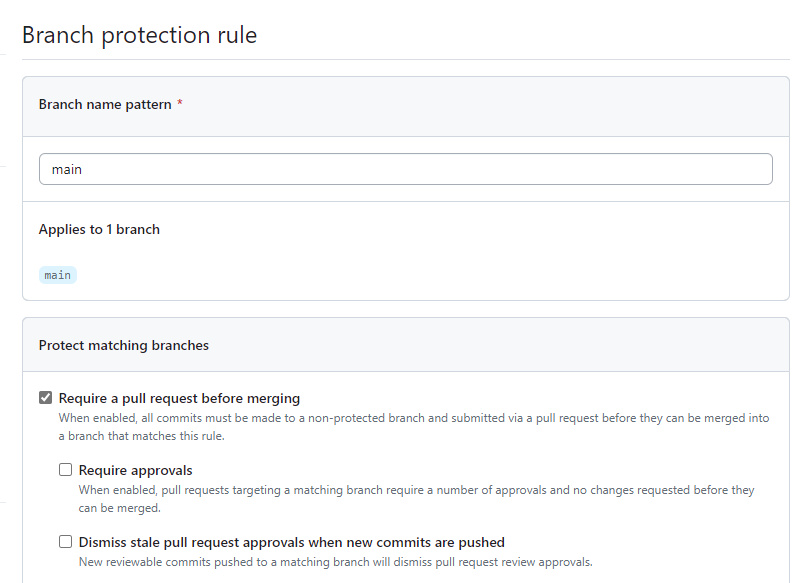
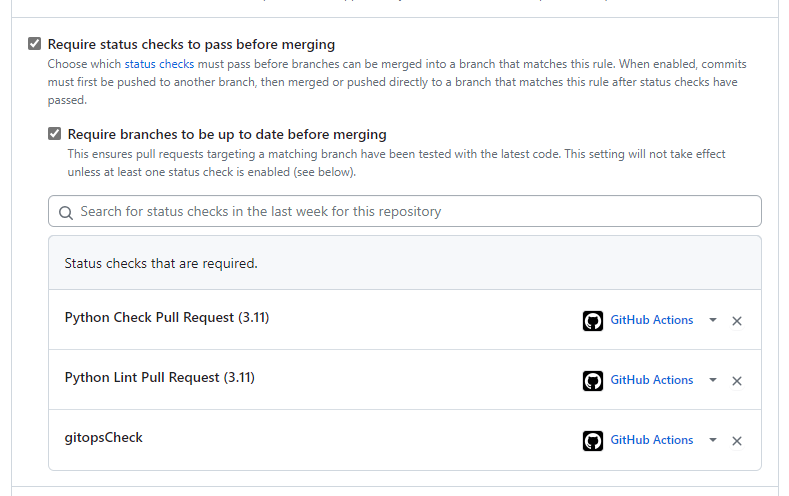

# action-toolbox
shared github action

### how to create sshkey

`ssh-keygen -t ed25519 -C "email@whater.com"`

### Some secrets expected

Some of this might change... just need to have it somewhere atm

Docker image push:
* `CONTAINER_REGISTRY_URL`
* `CONTAINER_REGISTRY_USERNAME`
* `CONTAINER_REGISTRY_PASSWORD`

Source repo:
* `SOURCE_KEY` (deploy key with write access, see how to create sshkey)

You will need this during release to override branch protection

Gitops Repo:
* `GITOPS_KEY` (deploy key with write access, see how to create sshkey)

Python package distributions:

*Pip*

If you want to upload to public pypi.org
* `PYPI_API_TOKEN`
Or if you have your own pypiserver, you will need to set
* `CUSTOM_PYPI_URL`
* `CUSTOM_PYPI_USERNAME`
* `CUSTOM_PYPI_PASSWORD`

*Conda*

If you want to upload to public anaconda.org
* `CONDA_API_TOKEN`
Or if you have a private QUETZ server
* `QUETZ_API_KEY`
* `QUETZ_URL`

### Repo setup

Below are the repository settings and branch protection rules which is recommended with these action tools

## Lock PR to Squash merging

    

## Add branch rule with require PR before merging

    

## Require status check to pass before merging

    
